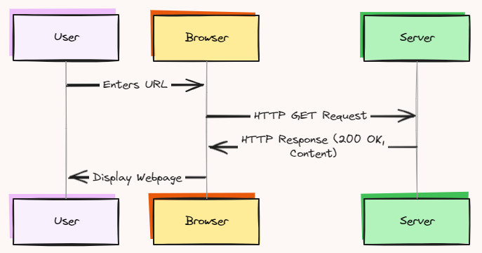

# Web Scraping Learning Journey

This repository serves as a companion for my journey in learning web scraping techniques. It contains code examples, notes, and resources related to web scraping using various tools and libraries.

## Table of Contents

- [Web Scraping Learning Journey](#web-scraping-learning-journey)
  - [Table of Contents](#table-of-contents)
  - [Introduction](#introduction)
  - [Learning Strategy](#learning-strategy)
  - [Tools and Libraries](#tools-and-libraries)
  - [Resources](#resources)
  - [Getting Started](#getting-started)
  - [Contributing](#contributing)

## Introduction

Web scraping involves extracting data from websites by automating the process of browsing and retrieving information. It has numerous applications, such as data mining, price monitoring, research, and content aggregation. However, it's essential to respect website terms of service and legal guidelines while practicing web scraping.

## Learning Strategy

My approach to learning web scraping involves the following steps:

1. **Understand the Fundamentals**: Start by grasping the basics of web scraping, including HTTP requests, HTML parsing, and handling dynamic content.
    - HTTP (Hypertext Transfer Protocol) is the primary protocol used for communication over the World Wide Web. It defines how web browsers and servers should interact and transfer data. When you enter a URL (Uniform Resource Locator) in your web browser, your browser sends an HTTP request to the server hosting the website, and the server responds with the requested data, such as an HTML page, image, or other resources.
    {: width="50%"}
    - HTTP requests components:
      - **Request Method**: The HTTP method used for the request, such as GET, POST, PUT, DELETE, etc.

        | Method     | Description                                                                                                             | Idempotent |
        |------------|-------------------------------------------------------------------------------------------------------------------------|------------|
        | GET   | Retrieves a resource from the server. Multiple identical requests return the same result.                               | Yes        |
        | PUT   | Updates or creates a resource. Multiple identical requests will update the same resource.                              | Yes        |
        | POST  | Creates new resources. Two identical POST requests will duplicate resource creation.                                    | No         |
        | DELETE| Deletes a resource. Multiple identical requests will delete the same resource.                                           | Yes        |
        | PATCH | Applies partial modifications to a resource.                                                                             | No         |
        | HEAD  | Asks for a response identical to a GET request but without the response body.                                             | Yes        |
        | CONNECT| Establishes a tunnel to the server identified by the target resource.                                                     | No         |
        | OPTIONS| Describes the communication options for the target resource.                                                              | Yes        |
        | TRACE | Performs a message loop-back test along the path to the target resource.                                                  | Yes        |
      - **Request URL**: The URL of the resource being requested.
      - **Request Headers**: Additional information sent with the request, such as user-agent, cookies, and content type.
      - **Request Body**: Data sent with the request, typically used with POST requests.
      - **Response Status Code**: A three-digit code indicating the status of the request, such as 200 (OK), 404 (Not Found), 500 (Internal Server Error), etc.
    - The Requests library in Python simplifies the process of sending HTTP requests and handling responses. It provides a user-friendly interface for creating requests, setting headers, handling cookies, and managing sessions.
2. **Explore Tools and Libraries**: Familiarize yourself with popular web scraping tools and libraries.
   - **Requests**: A Python library for making HTTP requests and handling responses. It is widely used for web scraping due to its simplicity and ease of use.
   - **Beautiful Soup**: A Python library for parsing HTML and XML documents. It provides tools for navigating the parse tree, searching for elements, and extracting data from web pages.
   - **Selenium**: A web automation tool that allows you to control a web browser programmatically. It is useful for scraping websites with JavaScript-rendered content or handling complex interactions.
   - **PlayWright**: A Node.js library for automating browsers. It provides a high-level API for interacting with web pages, handling JavaScript, and performing browser automation tasks.
3. **Practice on Static Websites**: Begin with scraping static websites to understand the core concepts and techniques.
    a. Check the robots.txt file of the website to see if web scraping is allowed or restricted. 
    b. Identify the structure of the website, including the URLs, HTML elements, and data you want to extract.
    c. Use i.e. the Requests library to send HTTP requests to the website and retrieve the HTML content.
    d. Turn the content into a parsable format using Selenium and extract the desired data.
    e. Store the extracted data in a structured format, such as a CSV file, JSON file, or database.

4. **Tackle Dynamic Websites**: Move on to more challenging tasks, such as scraping websites with JavaScript-rendered content and handling AJAX requests.
    a. Use Selenium or PlayWright to automate browser interactions and load dynamic content.
    b. Wait for the page to load completely before extracting data to ensure all content is available.
    c. Handle pagination, infinite scrolling, and other dynamic elements to scrape multiple pages or sections of a website.
    d. Optimize your scraping process by minimizing unnecessary requests, avoiding detection, and improving performance.

5. **Learn Data Extraction and Cleaning**: Develop skills in extracting relevant data from web pages and cleaning the extracted data for further analysis or storage.

6. **Handle Anti-Scraping Measures**: Understand techniques for bypassing anti-scraping measures, such as IP blocking, captchas, and rate limiting.

7. **Explore Advanced Topics**: Delve into advanced topics like distributed web scraping, scraping web APIs, and integrating with databases or cloud services.

8. **Build Projects**: Apply your knowledge by working on real-world web scraping projects to solidify your understanding and gain practical experience.

## Tools and Libraries

This repository contains examples and code snippets for various web scraping tools and libraries, including but not limited to:

- Requests
- Selenium
- Beautiful Soup
- Playwright

## Resources

Throughout my learning journey, I've compiled a list of helpful resources, including tutorials, documentation, articles, and online courses. These resources are available in the `resources` folder of this repository.

## Getting Started

To get started with this repository, follow these steps:

1. Clone the repository to your local machine using `git clone https://github.com/farahanasuhaimi/webscrape.git`
2. Navigate to the project directory: `cd webscrape`
3. Explore the code examples, notes, and resources in the respective folders.

## Contributing

Contributions to this repository are welcome! If you have any suggestions, improvements, or additional resources to share, please feel free to open an issue or submit a pull request.